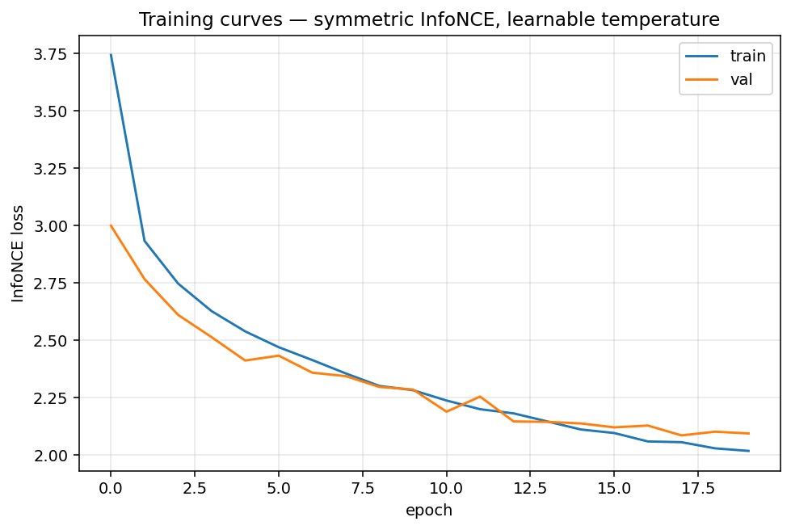

# Experiments & Ablations

## Experimental Setup

All experiments use the following fixed configuration unless otherwise noted:

| Hyperparameter | Value |
|----------------|-------|
| Dataset | Flickr30k (29,000 train / 1,000 val / 1,000 test) |
| Batch size | 128 |
| Optimizer | AdamW |
| Learning rate | 1e-3 |
| LR schedule | None |
| Epochs | 20 |
| Embedding dim | 256 |
| Dropout | 0.1 |
| Vision backbone | ResNet-50 (frozen) |
| Text backbone | DistilBERT-base-uncased (frozen) |
| Hardware | Kaggle T4 GPU |

---

## Experiment 1 — Baseline Training Run

**Goal:** Establish a baseline with default hyperparameters.

**Temperature:** Learnable, initialised at `log(1/0.07) ≈ 2.66`. Final value after 20 epochs: **τ = 0.0485** — the model sharpened its similarity distribution by ~30 % over the run.

**Wall time:** ~12 min on a Colab T4 (cached ResNet-50 features make each epoch ~30 s).

### Training Curves



| Epoch | Train Loss | Val Loss |
|-------|-----------|---------|
| 1     | 3.7433    | 2.9991  |
| 5     | 2.5386    | 2.4116  |
| 10    | 2.2824    | 2.2854  |
| 15    | 2.1110    | 2.1373  |
| 20    | **2.0175** | **2.0937** |

Train and val tracked tightly throughout — no overfitting (in some epochs val sits below train because dropout is active during training but disabled at eval time, which is expected).

### Retrieval Results (Test Set, 1,000 images × 5 captions)

| Direction    | R@1    | R@5    | R@10   |
|--------------|--------|--------|--------|
| Text → Image | 16.08% | 41.56% | 54.88% |
| Image → Text | 20.50% | 46.30% | 61.30% |

R@1 sits ~160× above random chance (0.1 % for 1k candidates), confirming the projection MLPs successfully aligned the two pretrained representation spaces despite both backbones being frozen.

---

## Experiment 2 — Temperature Ablation

**Goal:** Understand how the temperature hyperparameter τ affects alignment quality and retrieval performance.

**Motivation:** Temperature controls the sharpness of the softmax distribution in InfoNCE:
- **Low τ (e.g., 0.05):** Model is very confident, focuses on hard negatives, can be unstable early in training
- **High τ (e.g., 0.10):** Softer distribution, more stable training, potentially lower peak performance

**Setup:** 3 separate runs with fixed (non-learnable) temperatures: τ ∈ {0.05, 0.07, 0.10}. All other hyperparameters held constant.

### Results

| Temperature | R@1 (T→I) | R@5 (T→I) | R@1 (I→T) | R@5 (I→T) | Notes |
|-------------|-----------|-----------|-----------|-----------|-------|
| τ = 0.05    | —         | —         | —         | —         | —     |
| τ = 0.07    | —         | —         | —         | —         | CLIP default |
| τ = 0.10    | —         | —         | —         | —         | —     |
| τ = learnable | —       | —         | —         | —         | Baseline |

### Analysis

> *(To be filled in after experiments)*

---

## Experiment 3 — Embedding Space Visualization

**Goal:** Qualitatively validate that the shared embedding space is well-structured after training.

**Method:** Sample 500 matched (image, text) pairs from the test set. Compute embeddings for all 1,000 vectors (500 images + 500 texts). Apply UMAP with `n_components=2`. Plot with:
- 🔵 Blue dots = image embeddings
- 🟠 Orange dots = text embeddings
- Gray lines connecting matched pairs

**Expected result:** If training succeeded, matched pairs will be clustered near each other, and semantic categories (animals, sports, food, etc.) will form loose clusters across modalities.

### Visualization

> *(To be added after training)*

---

## Experiment 4 — Qualitative Retrieval Analysis

**Goal:** Understand failure modes beyond aggregate metrics.

**Method:** Run 20 hand-selected text queries against the test set and manually inspect top-5 retrieved images. Categorize results as:
- ✅ Correct (semantically matching)
- ⚠️ Partially correct (related content, wrong specifics)
- ❌ Incorrect (unrelated)

**Sample queries to test:**

```
"a dog running on the beach"
"two people sharing an umbrella"
"a child blowing out birthday candles"
"a street performer in a crowd"
"a woman reading a book outdoors"
"a plate of colorful food"
"a cat sitting on a windowsill"
"cyclists racing on a road"
```

### Results Table

> *(To be filled in after training)*

| Query | Top-1 Result | Correct? | Notes |
|-------|-------------|----------|-------|
| "a dog running on the beach" | — | — | — |
| ... | | | |

---

## Notes on Reproducibility

All experiments are reproducible with:

```python
torch.manual_seed(42)
torch.cuda.manual_seed(42)
import random; random.seed(42)
import numpy as np; np.random.seed(42)
```

Checkpoints for each experiment are saved in `experiments/checkpoints/exp_{id}/`.
