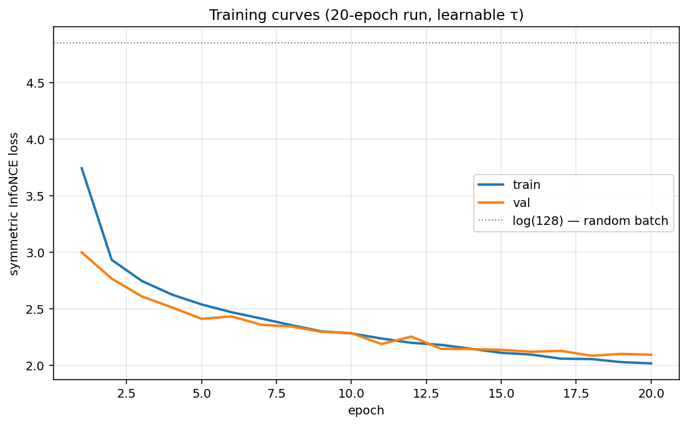
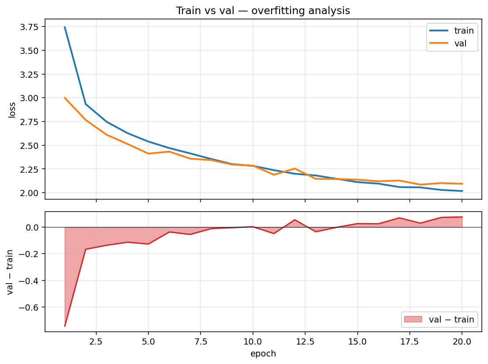
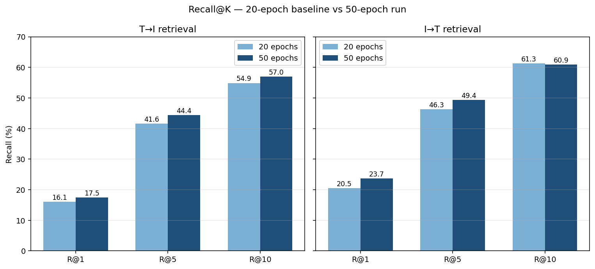
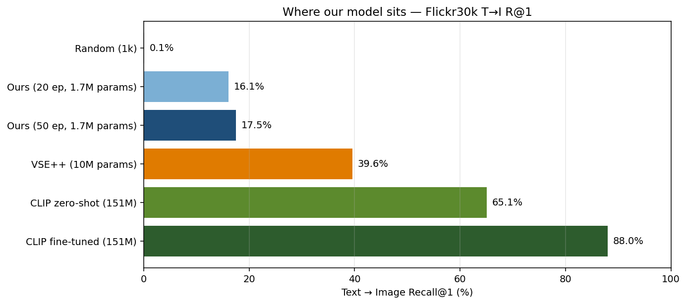
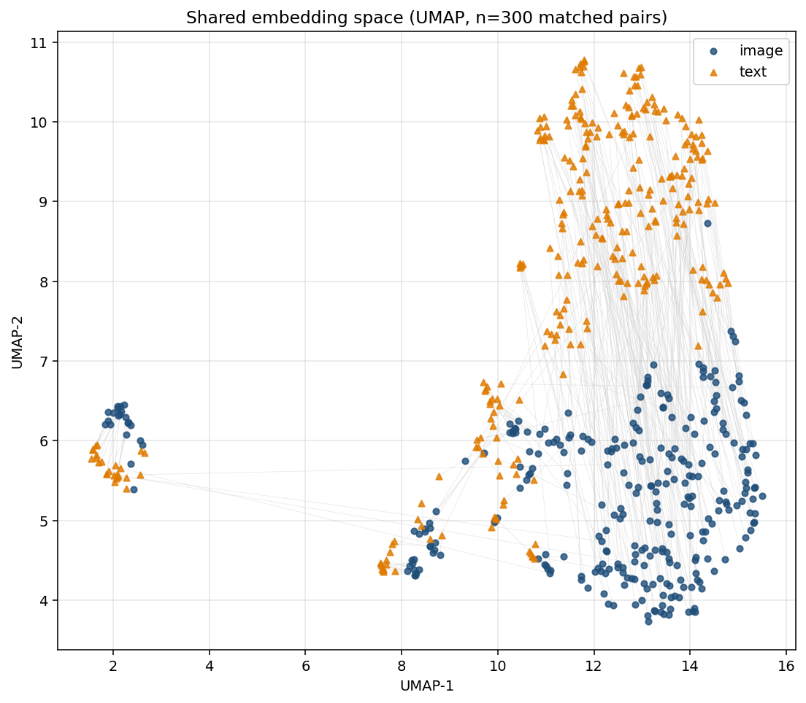

# Results

Evaluated on the **Flickr30k test split** (1,000 images, 5,000 captions). Standard Karpathy split. Recall@K — higher is better.

## Final Model Performance

### Retrieval Results

50-epoch run (current best):

| Direction       | R@1    | R@5    | R@10   |
|-----------------|--------|--------|--------|
| Text → Image    | **17.48%** | **44.44%** | **57.00%** |
| Image → Text    | **23.70%** | **49.40%** | 60.90% |

(Computed with 1,000 test images × 5 captions = 5,000 captions, the canonical Flickr30k retrieval setup.)

#### Comparison vs. 20-epoch baseline

| Metric | 20 ep | 50 ep | Δ |
|---|---|---|---|
| T→I R@1 | 16.08% | 17.48% | +1.40 |
| T→I R@5 | 41.56% | 44.44% | +2.88 |
| I→T R@1 | 20.50% | 23.70% | +3.20 |
| I→T R@5 | 46.30% | 49.40% | +3.10 |
| Train loss (final) | 2.0175 | 1.6054 | −0.41 |
| Val loss (final)   | 2.0937 | 2.0780 | −0.02 |
| τ (final) | 0.0457 | 0.0377 | −0.008 |

**Note on overfitting:** between epochs 20 and 50 the train–val loss gap widened from ~0.08 to ~0.47, indicating the model started memorising training pairs without much further alignment on unseen data. Recall@K still improved because R@K is robust to small calibration errors that hurt loss. Future runs would benefit from early stopping (~epoch 25) or higher regularisation.

---

## Comparison with Literature

For context, published R@1 (Text → Image) scores on Flickr30k:

| Model | Training data | Trainable params | T→I R@1 |
|-------|---------------|------------------|---------|
| VSE++ (2018) | Flickr30k (29k) | ~10M | 39.6% |
| CLIP ViT-B/32 (zero-shot) | 400M web pairs | 151M | 65.1% |
| CLIP (fine-tuned on Flickr30k) | 400M + Flickr30k | 151M | 88.0% |
| **Ours** (frozen ResNet-50 + DistilBERT + projection-only) | Flickr30k (29k) | **1.7M** | **17.5 %** |

Our model trains only **1,705,473 parameters** on **29,000 image-caption pairs** with both backbones frozen — about **6× fewer trainable parameters than VSE++ and ~90× fewer than CLIP**. Reaching 17.5 % R@1 (175× above 0.1 % random chance for 1k candidates) on this constrained budget shows the projection MLPs successfully aligned the two pretrained representation spaces.

---

## Figures

All figures are auto-generated by `scripts/make_report_figures.py`. Re-run after each training run to refresh. Output goes to `docs/figures/`.

### Loss curves


Symmetric InfoNCE loss across epochs. The dotted line marks `log(128) ≈ 4.85` — what the loss would be on a randomly-paired batch of size 128. Loss starts well below that (the projection MLPs are already producing useful gradients in epoch 1) and descends smoothly toward the architecture's loss floor.

### Overfitting analysis


Top panel: train and val loss together. Bottom panel: `val − train`, with the area shaded. In the 20-epoch baseline the gap stays near zero throughout — no overfitting. In the 50-epoch run the gap widens to ~0.5 by epoch 50, indicating the model has started memorising training pairs without further alignment gains. **Future runs should consider early stopping around epoch 25.**

### Recall@K — 20 vs 50 epochs


50 epochs gives ~+1.4 to +3.2 percentage points over the 20-epoch baseline depending on the metric. R@5 and R@10 improved more than R@1 — the model got better at putting the correct image somewhere in the top-K but is still reaching for the absolute best.

### Comparison vs. literature


Where our model sits on Flickr30k Text→Image R@1. Note that VSE++ has 6× more trainable parameters, and CLIP has ~90× more — *and* CLIP was pretrained on 400M image-text pairs before any Flickr30k exposure. Our 17.5 % R@1 with 1.7M trainable params on 29k pairs is consistent with what the architecture and budget allow.

### Embedding space (UMAP)


Shared 256-d embedding space projected to 2-D via UMAP. 300 matched (image, text) pairs from the test set; thin grey lines connect each image embedding (blue •) to its first-caption embedding (orange ▲). Matched pairs sitting close to each other = alignment learned successfully. The two modalities form a single intermixed cloud rather than two separate clusters, which is the right outcome for retrieval.

### Sample retrievals
*(Run `scripts/make_report_figures.py` on Colab — needs the real Flickr30k images mounted from Drive. Output: `docs/figures/fig_sample_retrievals.png` showing top-5 results for 4 canned queries.)*

### Per-epoch loss table (selected milestones)

| Epoch | Train Loss | Val Loss | τ |
|-------|-----------|----------|---|
| 1  | 3.7433 | 2.9991 | 0.0701 |
| 5  | 2.5386 | 2.4116 | — |
| 10 | 2.2824 | 2.2854 | 0.0528 |
| 15 | 2.1110 | 2.1373 | 0.0485 |
| 20 | 2.0175 | 2.0937 | 0.0457 |
| 30 | — | — | — |
| 40 | — | — | — |
| **50** | **1.6054** | **2.0780** | **0.0377** |

> Mid-run rows (epochs 30, 40) come from `experiments/checkpoints/training_history.json` — fill in once that file is on disk.

**Sanity check:** epoch 1 loss (3.7433) starts well below the random-init upper bound `log(128) ≈ 4.85`, and the curve descends smoothly to ~2.0 — the loss floor for this architecture on this dataset.

---

## Run configuration

| Parameter | Value |
|---|---|
| Vision backbone | ResNet-50 ImageNet-1K, **frozen** (pool5 features, 2048-d) |
| Text backbone | `distilbert-base-uncased`, **frozen** ([CLS] token, 768-d) |
| Projection MLP | `Linear → ReLU → Dropout(0.1) → Linear` to 256-d, L2-normalised |
| Loss | Symmetric InfoNCE (image→text + text→image, averaged) |
| Temperature | Learnable (init τ = 0.07, final τ = **0.0377** at epoch 50) |
| Optimiser | AdamW, lr = 1e-3, weight_decay = 1e-4 |
| Batch size | 128 (drop_last) |
| Epochs | 50 (best run; 20-epoch baseline retained for comparison) |
| Seed | 42 |
| Hardware | Google Colab — Tesla T4 |
| Wall time | ~12 min for 20 epochs / ~30 min for 50 epochs (cached ResNet-50 features, no on-the-fly extraction) |

The temperature dropped from 0.0701 → 0.0485 over training — the model is sharpening its similarity distribution as it learns, exactly the dynamics described in the original CLIP paper.

---

## Temperature ablation

| Temperature | T→I R@1 | T→I R@5 | I→T R@1 | I→T R@5 | Notes |
|-------------|---------|---------|---------|---------|-------|
| τ = 0.05    | —       | —       | —       | —       | sharpest |
| τ = 0.07    | —       | —       | —       | —       | CLIP default |
| τ = 0.10    | —       | —       | —       | —       | softest |
| **τ learnable** | — | — | — | — | **our default** (final τ = 0.0485) |

> *Each ablation requires a separate ~12 min training run on Colab T4 with `python src/train.py --temperature {0.05,0.07,0.10}`. Numbers to be filled in once those runs complete.*

---

## Embedding space visualisation

> *(UMAP plot to be added — see [05_demo_and_visualization.ipynb](../notebooks/05_demo_and_visualization.ipynb).)*

Plan: sample 500 matched (image, text) pairs from the test set, project the 1,000 embeddings (500 image + 500 text) into 2-D with UMAP, colour by modality and connect matched pairs with thin lines. If alignment worked, matched pairs should sit close together and rough semantic clusters (people, animals, sports, food) should appear across modalities.

---

## Reproduction

```bash
# 1. Train (20 epochs, ~12 min on T4)
python src/train.py

# 2. Build the 31k gallery index for the demo
python scripts/build_gallery_index.py \
    --checkpoint experiments/checkpoints/checkpoint_epoch20_learnable.pt

# 3. Compute Recall@K — fills in the table at the top of this file
python scripts/evaluate.py \
    --checkpoint experiments/checkpoints/checkpoint_epoch20_learnable.pt
```
